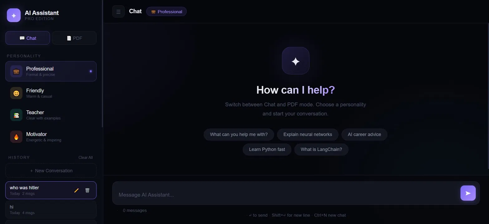
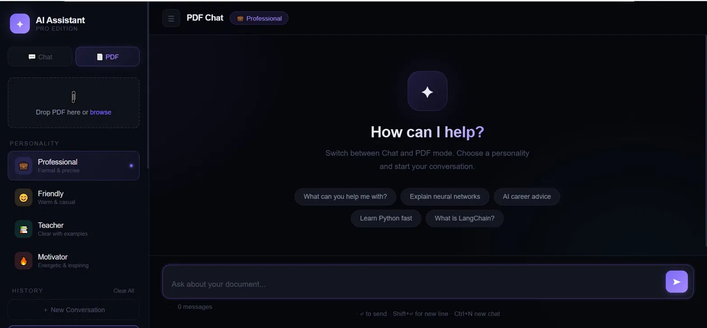

# 🤖 AI Assistant Pro

A sleek, feature-rich AI chat application built with FastAPI and LangChain — supporting multiple personalities, real-time streaming, and PDF document Q&A.


---

## ✨ Features

- 💬 **Real-time streaming** — Responses stream token by token instantly
- 🎭 **4 AI Personalities** — Professional, Friendly, Teacher, Motivator
- 📄 **PDF Chat mode** — Upload any PDF and ask questions about it
- 🕓 **Chat History** — Conversations saved locally with smart date labels
- 🌙 **Dark UI** — Clean, modern dark interface with smooth animations
- 📋 **Copy & Export** — Copy messages or export full chat as `.txt`
- ⌨️ **Keyboard Shortcuts** — `Ctrl+N` new chat, `Ctrl+K` focus input, `Ctrl+B` sidebar

---

## 🛠️ Tech Stack

| Layer | Technology |
|---|---|
| Backend | FastAPI, Python |
| LLM | LLaMA 3.1 8B via Groq API |
| RAG Pipeline | LangChain, ChromaDB, HuggingFace Embeddings |
| PDF Processing | PyPDF, RecursiveCharacterTextSplitter |
| Frontend | Vanilla HTML/CSS/JS, marked.js, highlight.js |

---

## 🚀 Getting Started

### 1. Clone the repository
```bash
git clone https://github.com/your-username/ai-assistant-pro.git
cd ai-assistant-pro
```

### 2. Install dependencies
```bash
pip install -r requirements.txt
```

### 3. Set up environment variables
Create a `.env` file in the root directory:
```env
GROQ_API_KEY=your_groq_api_key_here
```
Get your free API key at [console.groq.com](https://console.groq.com)

### 4. Run the app
```bash
uvicorn main:app --reload
```

Open your browser at `http://localhost:8000`

---

## 📁 Project Structure

```
ai-assistant-pro/
├── main.py              # FastAPI backend
├── static/
│   └── index.html       # Frontend UI
├── requirements.txt
├── .gitignore
└── README.md
```

---

## 📸 Preview

### 💬 Chat Mode


### 📄 PDF Mode


---

## 📝 License

MIT License — free to use and modify.
